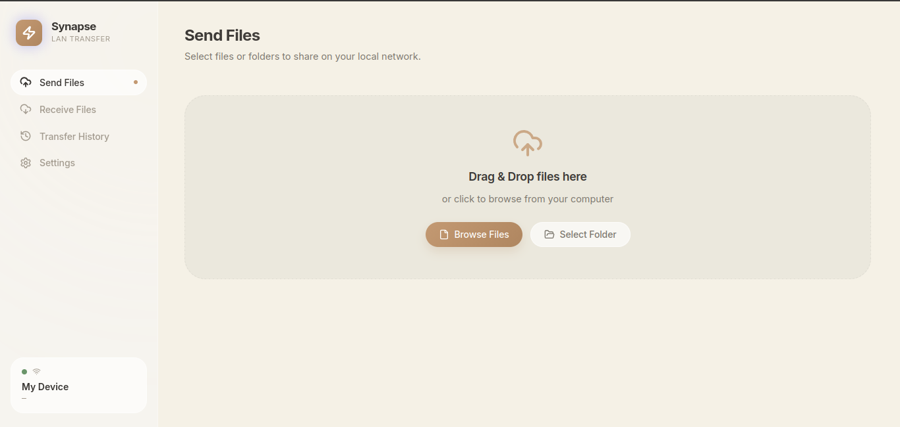
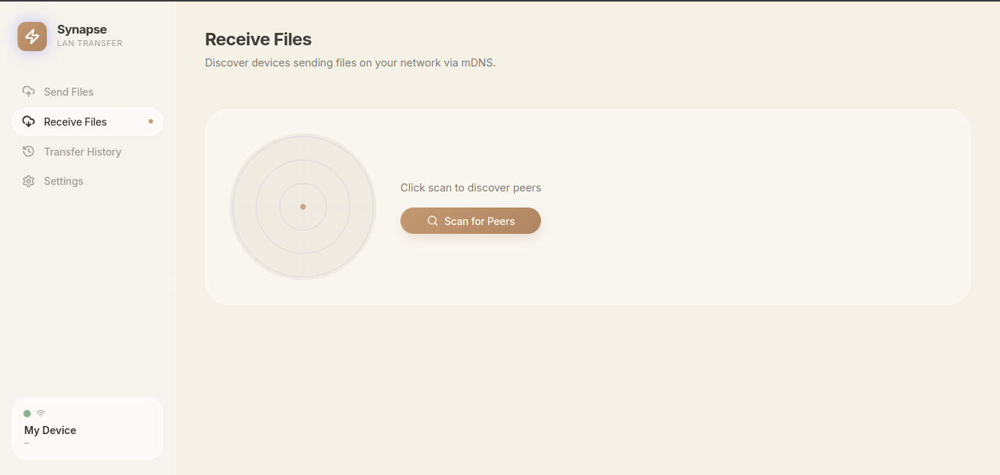
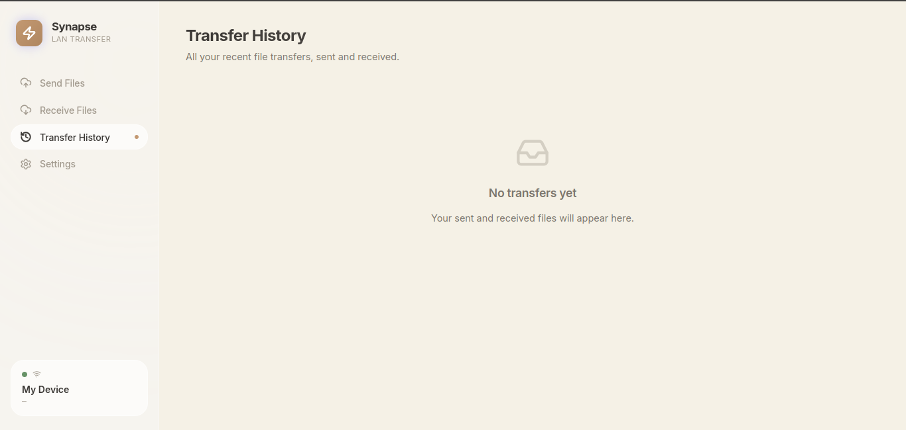
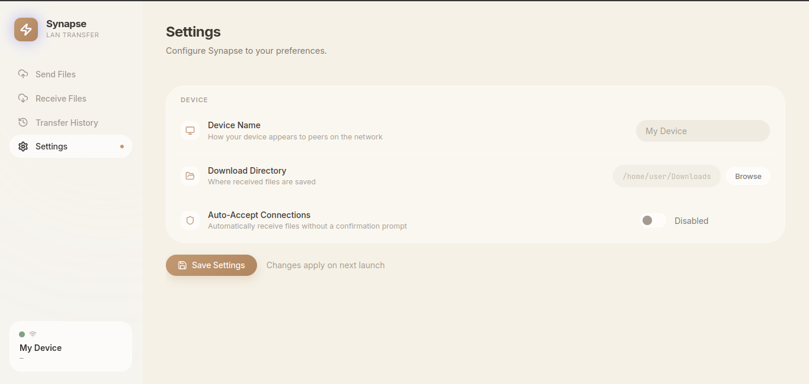
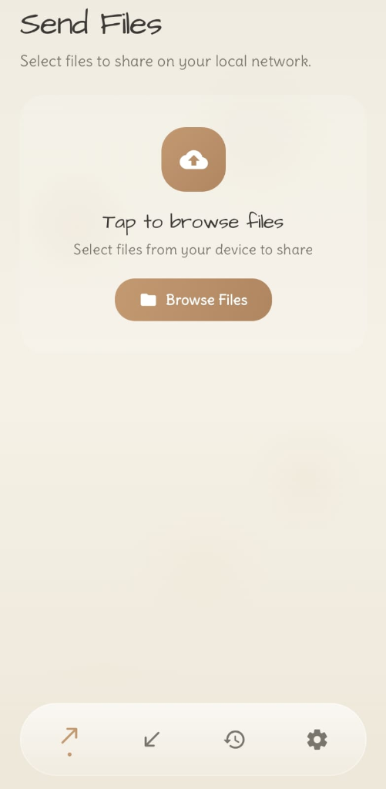
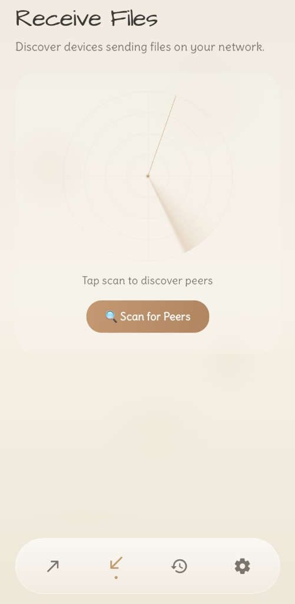
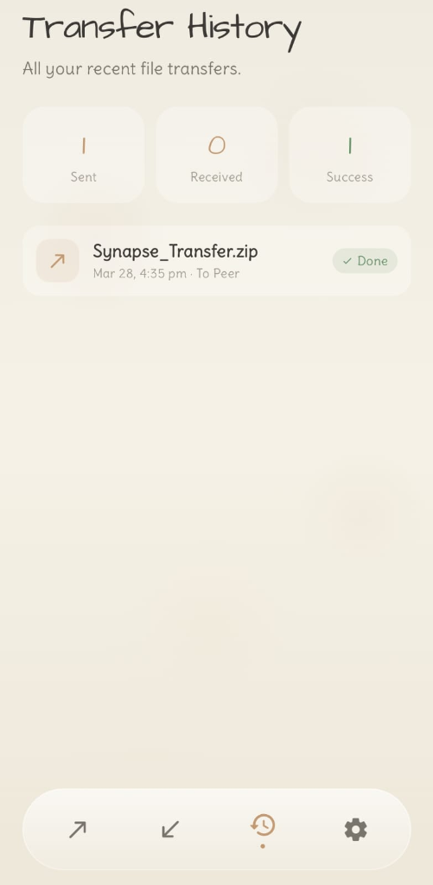
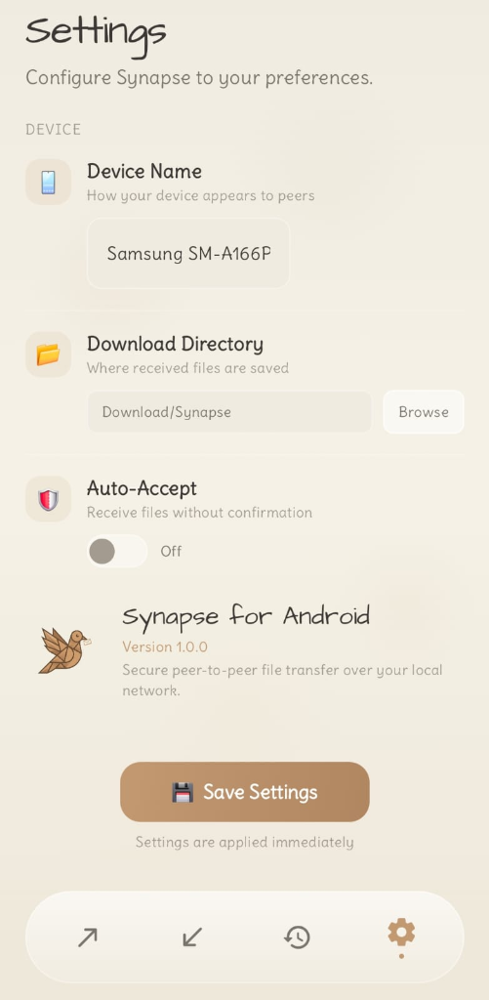

<p align="center">
  
</p>

<p align="center">
  <a href="https://go.dev//">
    
  </a>
  <a href="https://github.com/id-root/LanDrop">
    
  </a>
  <a href="https://opensource.org/licenses/MIT">
    
  </a>
  <a href="https://wails.io">
    
  </a>
</p>


#  Synapse
Synapse is a high-performance, peer-to-peer file transfer system designed for Local Area Networks. It combines a premium desktop interface built with React and Wails v2 into a single native binary, enabling seamless cross-platform deployment.

The system leverages mDNS for zero-configuration device discovery and implements end-to-end encryption to ensure secure, direct transfers without intermediaries.

With native clients across desktop and Android, Synapse delivers fast, frictionless file sharing across heterogeneous devices on the same network


### 💻 Desktop Interface
<table>
  <tr>
    <td><br><b>Send Files</b></td>
    <td><br><b>Receive Files</b></td>
  </tr>
  <tr>
    <td><br><b>Transfer History</b></td>
    <td><br><b>Settings</b></td>
  </tr>
</table>

### 📱 Mobile Interface (Android)
<table>
  <tr>
    <td><br><b>Mobile Send</b></td>
    <td><br><b>Mobile Receive</b></td>
  </tr>
  <tr>
    <td><br><b>Mobile History</b></td>
    <td><br><b>Mobile Settings</b></td>
  </tr>
</table>

## Features

- **🖥️ Native Desktop GUI** — Premium dark-mode interface built with React, Vite, and Framer Motion on Wails v2. Single binary footprint.
- **📁 File & Directory Transfer** — Send individual files or entire folders (auto-zipped and streamed).
- **🔍 Zero Configuration** — Automatic peer discovery on LAN using mDNS. No IP addresses, no setup.
- **🔒 End-to-End Encrypted** — All transfers use TLS with ephemeral self-signed certificates.
- **✅ Integrity Verified** — SHA-256 checksums verify every transfer with native cryptographic integrity.
- **⏸️ Resumable Transfers** — Detects partial files and resumes from where they left off.
- **⚡ Adaptive Compression** — Text files compressed with Zstandard; already-compressed formats sent raw.
- **📊 Real-Time Progress** — Live progress bar, speed, and percentage displayed in the GUI.
- **📜 Transfer History** — All transfers (sent and received) logged with timestamps and status.
- **⚙️ Configurable** — Device name, download directory, and auto-accept settings.
- **👥 Multi-Receiver** — Multiple receivers can download the same file simultaneously.

## Installation

### Download Pre-built Binaries

Download the latest release from [GitHub Releases](https://github.com/id-root/Synapse/releases):

| Platform | Download |
|----------|----------|
| **Android** | [`synapse.apk`](https://github.com/id-root/Synapse/releases) |
| **Windows (Installer)** | [`synapse-amd64-installer.exe`](https://github.com/id-root/Synapse/releases) |
| **Windows (Portable)** | [`synapse-windows-amd64.zip`](https://github.com/id-root/Synapse/releases) |
| **Linux (amd64)** | [`synapse-linux-amd64.tar.gz`](https://github.com/id-root/Synapse/releases) |

### 📱 Synapse for Android

The Android version brings the same "Elegant Beige" experience to your mobile device.

1. **Download** the `synapse.apk` from the latest release.
2. **Install** it on your Android device (ensure "Install from Unknown Sources" is enabled).
3. **Permissions**: The app requires "Nearby Devices" permission for discovery and "Files/Media" access for transfers.

#### Linux Requirements
```bash
sudo apt install libgtk-3-0 libwebkit2gtk-4.1-0
```

#### Windows Requirements
- WebView2 Runtime (included in Windows 10/11)

### Build from Source

#### Prerequisites

- Go 1.21+
- Node.js 18+ (for frontend Vue/React build)
- [Wails CLI](https://wails.io/docs/gettingstarted/installation) v2
- Linux: `libgtk-3-dev` and `libwebkit2gtk-4.1-dev`

```bash
# Install Wails CLI
go install github.com/wailsapp/wails/v2/cmd/wails@latest

# Clone and build
git clone https://github.com/id-root/LanDrop.git
cd LanDrop

# Linux
wails build -tags webkit2_41

# Windows (on a Windows machine)
wails build
```

The binary will be at `build/bin/synapse` (or `synapse.exe` on Windows).

## Usage

### Send Files

1. Open Synapse
2. Go to **Send Files** tab (default)
3. Click **Browse Files** or **Select Folder**
4. Click **Start Sending** — the app broadcasts on your LAN
5. When a receiver connects, the transfer starts automatically

### Receive Files

1. Open Synapse on the receiving device
2. Go to **Receive Files** tab
3. Click **Scan for Peers** — discovered senders appear as cards
4. Click **Connect to Receive** on the desired peer
5. The file downloads to your configured download directory

### Settings

- **Device Name** — Customize how your device appears to peers
- **Download Directory** — Where received files are saved
- **Auto-Accept** — Automatically accept incoming connections without prompts

### Development Mode

```bash
# Hot-reload dev server
wails dev -tags webkit2_41
```

## Architecture

```
synapse/
├── main.go                    # Wails app entrypoint
├── gui/
│   ├── app.go                 # Wails-bound methods (send, receive, scan, etc.)
│   ├── settings.go            # Config persistence (~/.config/synapse/)
│   └── history.go             # Transfer history
├── frontend/
│   ├── src/
│   │   ├── main.jsx           # React app entry
│   │   ├── App.jsx            # Main app shell & router
│   │   ├── tabs/              # Tab components (Send, Receive)
│   │   └── components/        # Isolated UI components
│   ├── package.json           # Frontend dependencies
│   └── vite.config.js         # Vite bundler configuration
├── internal/
│   ├── discovery/             # mDNS discovery (_synapse._tcp)
│   └── transfer/
│       ├── sender.go          # TLS sender with progress callbacks
│       ├── receiver.go        # TLS receiver with progress callbacks
│       ├── protocol.go        # Wire protocol (headers, chunking)
│       └── security.go        # Ephemeral TLS certificate generation
└── .github/workflows/
    └── release.yml            # CI/CD: build Linux + Windows, create release
```

### Wire Protocol

All transfers use TLS over TCP with this protocol:

1. **Header**: 8-byte length + JSON Metadata (`{"name", "size", "compression", ...}`)
2. **Request**: 8-byte length + JSON (`{"offset": ...}`) for resume support
3. **Content**: Raw or Zstd-compressed stream (chunked encoding if compressed)
4. **Footer**: SHA-256 checksum (32 bytes on wire)

## Troubleshooting

- **"No peers found"** — Ensure both devices are on the same network. Some corporate/public WiFi blocks mDNS (multicast).
- **Firewall** — Allow incoming TCP connections and UDP multicast (port 5353).
- **Checksum Mismatch** — Retry the transfer; it will resume automatically.
- **Linux: App won't start** — Install runtime dependencies: `sudo apt install libgtk-3-0 libwebkit2gtk-4.1-0`

## License

MIT [LICENSE](LICENSE)

